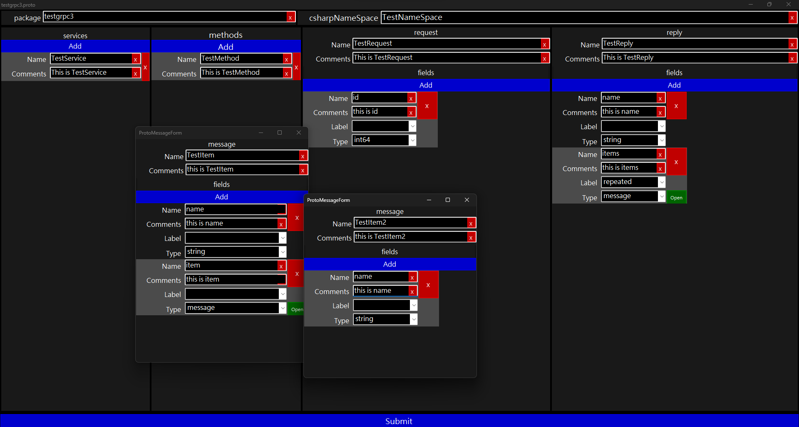
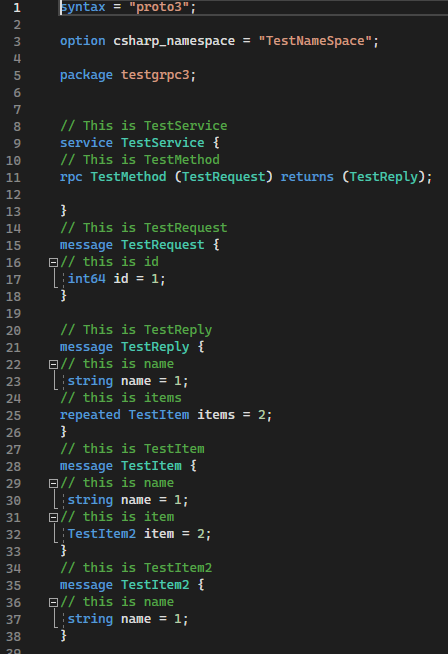

# TestGrpcApi

## VSIX

## 附註
### 範本的key.snk需自行產生
* https://learn.microsoft.com/zh-tw/visualstudio/extensibility/how-to-use-wizards-with-project-templates?view=vs-2022#connect-the-wizard-to-the-custom-template
* 簽署元件。方案總管，VSIX 專案，滑鼠右鍵，屬性，簽署。選取'簽署元件'。點擊'選擇強式名稱金鑰檔(K)'，新增。金鑰檔名稱，輸入key.snk。取消打勾'以密碼保護我的金鑰檔(P)'，確定。
* 專案中的'key.snk'檔案，右鍵，屬性，'複製到輸出目錄'，'一律複製'。
* 專案資料夾\bin\Debug，在目錄下開啟PowerShell。

### PowerShell指令
* '& 'C:\Program Files (x86)\Microsoft SDKs\Windows\v10.0A\bin\NETFX 4.8 Tools\sn.exe' -p key.snk outfile.key'，產生outfile.key檔案。
* '& 'C:\Program Files (x86)\Microsoft SDKs\Windows\v10.0A\bin\NETFX 4.8 Tools\sn.exe' -t outfile.key'，不關視窗，準備複製Token。
* 在專案下的.vstemplate檔案，替換PublicKeyToken中的值。